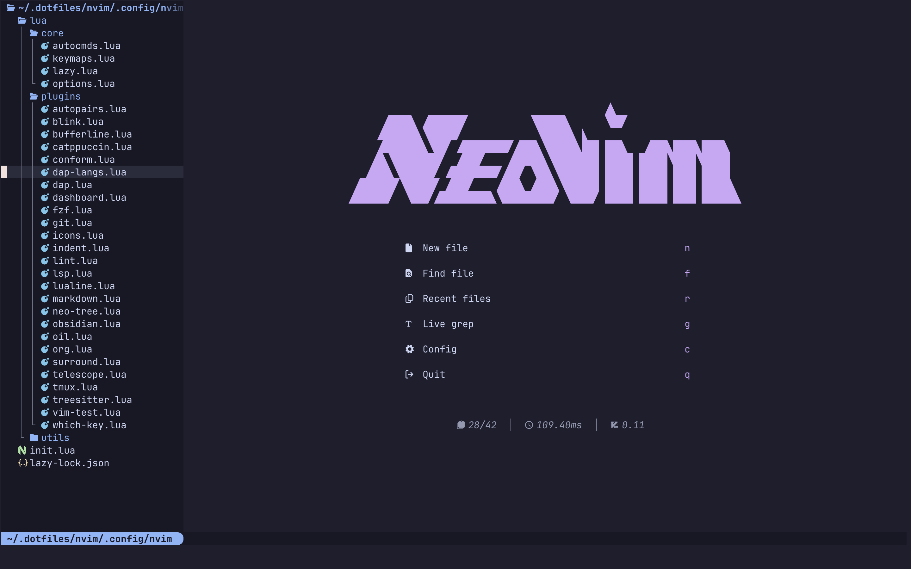

I've been using Neovim for the last 1.5 years and I genuinely love it. I got to know about Neovim from Stack Overflow and YouTube. I had a very old Sony laptop from 2010 running Windows 7 — it was my first laptop and I was using VSCode on it, but it used to lag a lot. I couldn't even use the browser properly. So I searched online and found out about Ubuntu, which turned out to be one of the best decisions I've ever made — not just for performance, but because it taught me Linux CLI which every developer should know.
That same post also mentioned Neovim as a lightweight editor that works great on Linux. It was the first time I'd ever heard of Neovim. I already knew Vim motions since I used to use them in VSCode with the Vim extension — I had searched on YouTube for "must have VSCode extensions" and someone recommended it. It had a learning curve but I loved it so much.